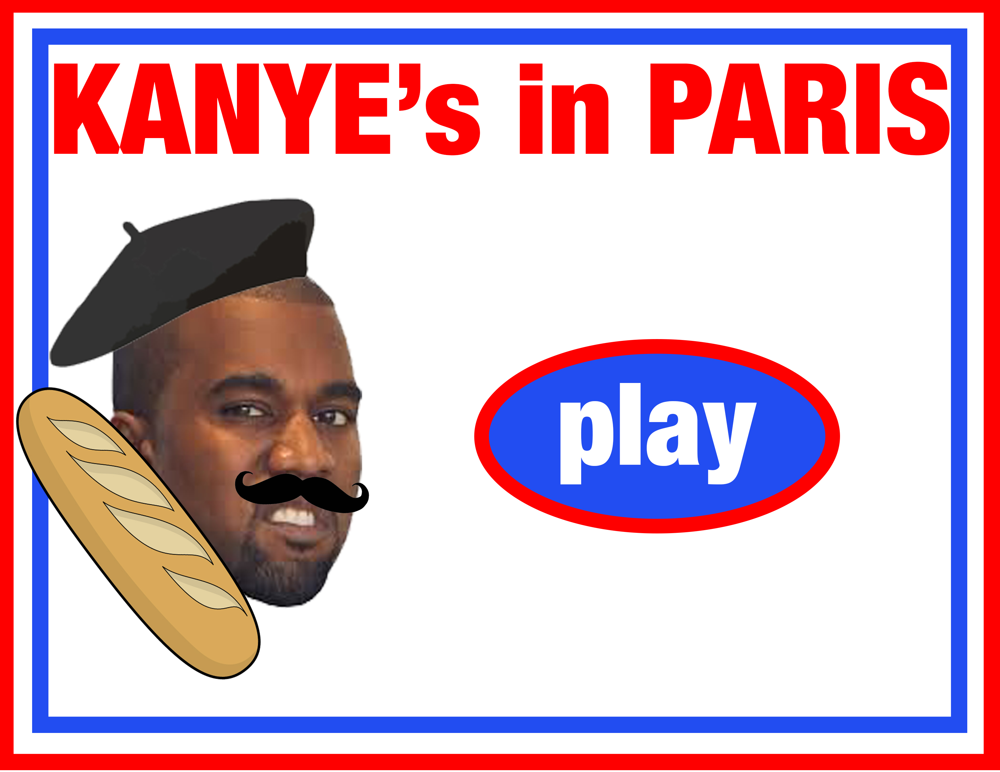
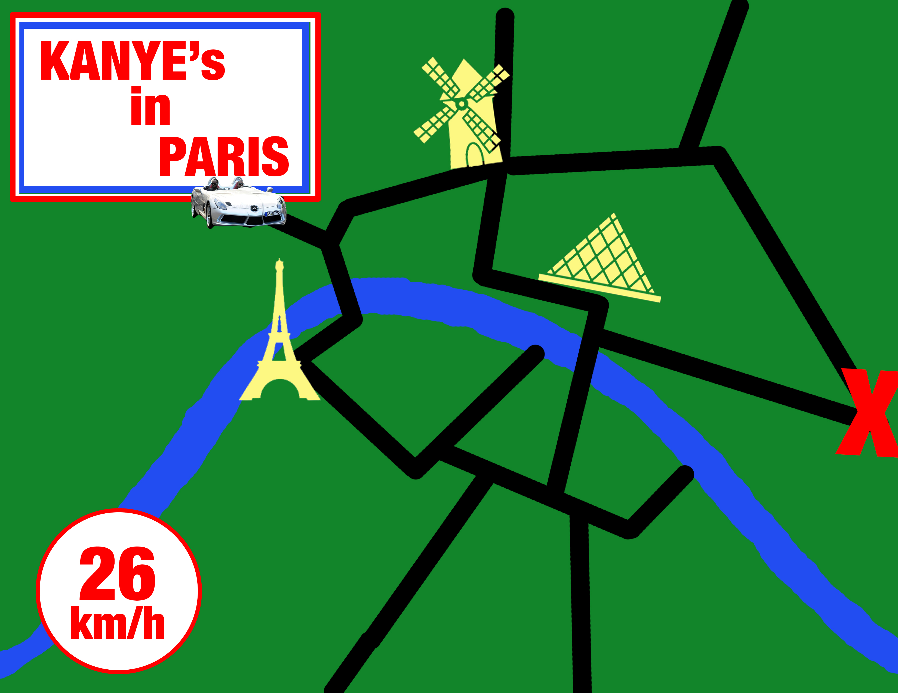
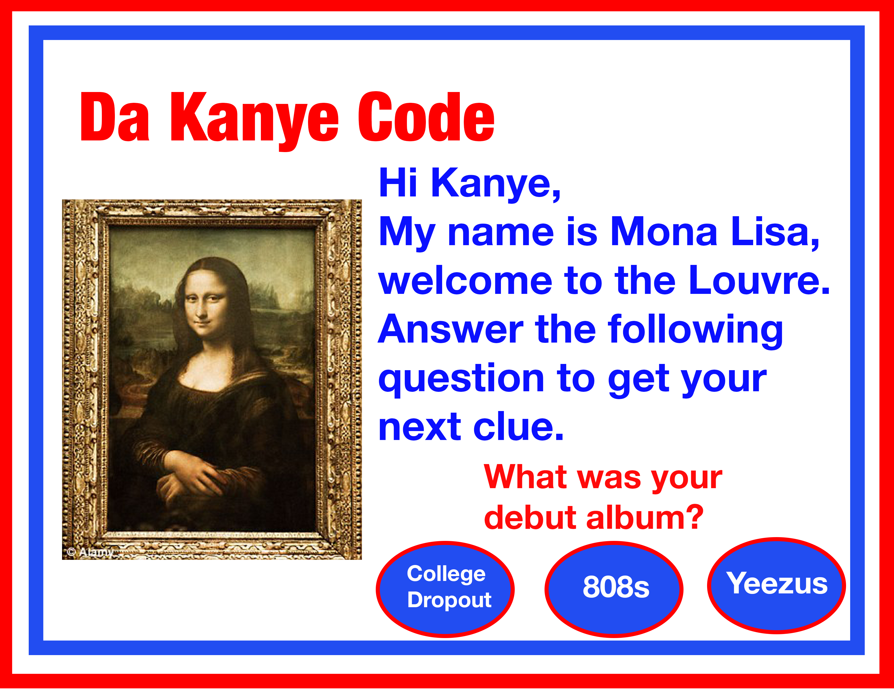

#Kanye's In Paris
##By Adam Kercheval, Will Mairs, and Avery Spratt (Team 6)

Oh no! You're Kanye west, and you've just learned, mid-world tour, that the love of your life,
Kim K., has been robbed at gunpoint in Paris! You're (obviously) wildin' the f*ck out [(goin' Bobby Boucher,
one might say)](https://genius.com/1781251), and you decide to hop on a plane to De Gaulle A$AP.

Once you get to Paris, though, aside from going gorillas, you've got to drive around the city to find the clues to solve the crime.

Drive from point to point in the City of Love, solving the Crime of the Century,
before time runs out! But remember, [Drive Slow, Homie](https://genius.com/Kanye-west-drive-slow-lyrics)!
Parisian detectives are no good, but their traffic cops are the best around.
If you get arrested for speeding, you lose time!

### Problem Statement:
Kim has been robbed, and you have to find out who did it!

### How do you solve the problem?
Interactively drive around a map of Paris from point to point to collect clues, being careful
that you don't exceed the speed limit and get arrested.

### Features:
* Client-side data persistence, to store clues that have already been found and past scores
* Push notifications to inform the player of where to go to find the next clue, or when they
have been arrested for speeding
* Reporting data at the end of the game in charts and graphs (average speed, time spent
    searching, number of arrests, etc.)

### We may include:
* Front-end framework like bootstrap to display the board and clues side-by-side, and to show
the data at the end of the game
* Geolocation, if we want to get fancy and put the user on an actual map of Paris

### Notes:
We're planning on using an HTML canvas element to store the game, based off the code found
[here](http://ucfcdl.github.io/html5-tutorial/) (some preliminary code for which is already in this repo as
index.html, script.js, and style.css). We'lll change the car icon and the background,
and we'll use the coordinates that the car is at on the canvas to keep track of whether the player is on the road and
has reached the necessary location. We'll also change the speed element so that when you press
the up arrow (or 'W', whatever it may be) the car doesn't just move forward - its speed also
increases.
A soundtrack for the game (tentatively) will be Kanye saying "drive slow" on a repeating loop
from [this song](https://www.youtube.com/watch?v=RxNdSDraYOU).

#Comments by Ming
* Total win just on the title *and* the reference to the legendary Bobby Boucher alone.
